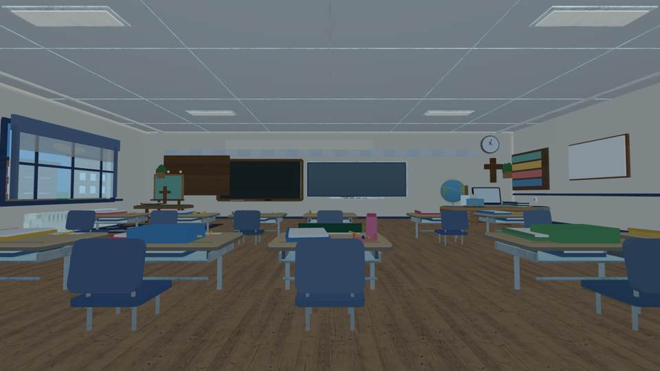
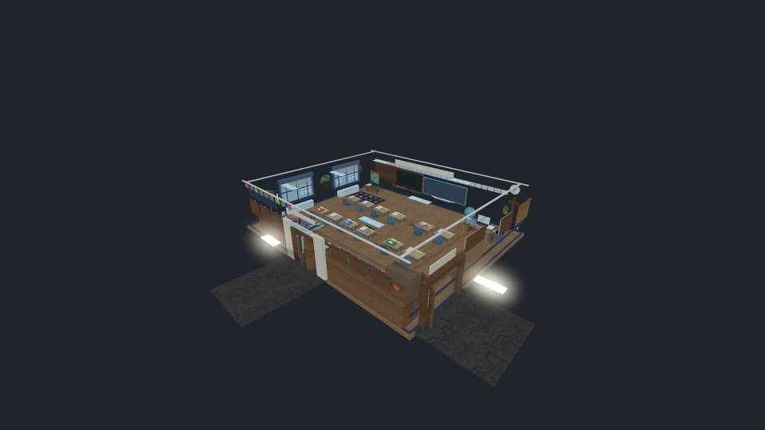

# Emma's Classroom — front-left art easel sightline

**Visual QA verdict: Accepted incremental improvement, not Roblox-native release acceptance.**

The existing teaching-wall design was already verified. The only targeted change
in this pass moves an easel formerly obscuring the left part of the chalkboard.
The poster, timber supports, display ledge, and three original stars are now all
derived from a single `easelX=-29` coordinate rather than mismatched constants.
No menus, questions, teacher NPCs, imported furniture or gameplay were changed.

## Identical camera, source-derived actual images

| Before: easel intrudes on chalkboard | After: easel moved to far-left art corner |
| --- | --- |
|  |  |

**Before Luau source SHA:** `15bc6c54e9412030361cb10b0d9175d60c9e0382`. [Passing before visual run](https://github.com/P00NSMASHER/PipsQuestWorld/actions/runs/37819681530).

**After physical source change SHA:** `b5242824d08d675bb3c91534078ee4b843bc88eb`.
**After source + executed geometric guard SHA:** `7b0d0a835787e37311d0aed2540ff398ce813805`.
[Passing exact-head after visual run](https://github.com/P00NSMASHER/PipsQuestWorld/actions/runs/37821220804).

Camera for both matched eye-level screenshots:
`--camera=0,5.5,18 --look-at=0,7,-33` on the full constructed classroom.

## Actual constructed geometry validation

The complete Luau room constructor executed successfully, yielding **2,768 physical
parts**, with **2,731** in the intentional architectural cutaway.
The exact-head renderer logs reported:

- `TEACHING_WALL_GEOMETRY_PASS smartboard=18.85 chalkboard=15.80 gap=1.57 frame=19.35`
- `EASEL_CHALKBOARD_CLEARANCE_PASS gap=4.75 x=-29.00`
- All three original easel star positions, both support legs, its wooden board,
  display ledge and mounted poster remained aligned under explicit assertions.
- The easel was verified clear of the left interior wall and in the front corner.
- Front eye-level render: `VISUAL_NONBLANK_PASS`, channel span **203**,
  near-white ratio **0.000**; actual pixel image independently inspected.
- [Exact-head classroom build](https://github.com/P00NSMASHER/PipsQuestWorld/actions/runs/37821220867):
  **PASSED**. Other source checks and the original furniture mesh generation passed.

The chair and desk GLB importer remains disabled until a dedicated authorized Roblox
Assets API key and native verification become available. All 16 desk/chair positions,
colliders, first-person control, and the excluded educational systems remain unchanged.

## Known limits

The headless third-party renderer approximates Roblox visuals. These PNG/JPEGs do
**not** establish Roblox Studio display quality, iPhone touch movement, mobile
frame rates, or matching measurements to the unavailable original classroom photos.
The overall classroom, especially the furniture and storage details, remains too
primitive for final visual acceptance. The PR is a draft, **not published or merged**.
