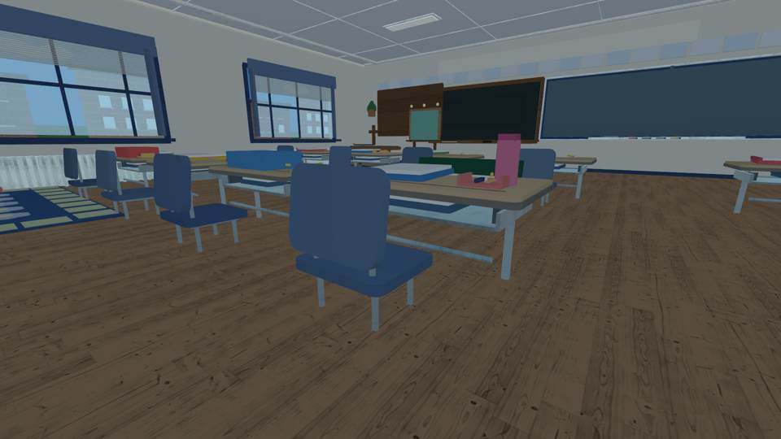
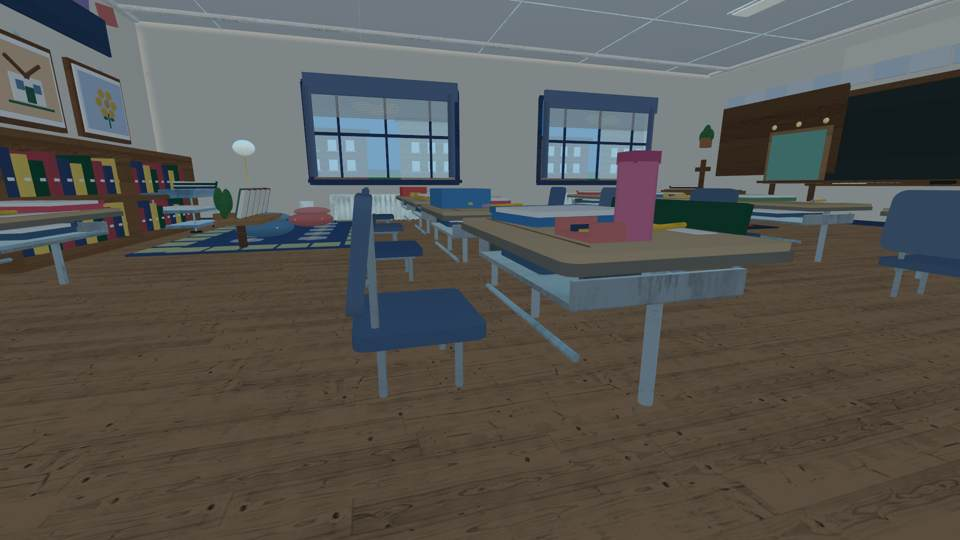

# Emma classroom: rounded school chair profile

Implementation source commit: `fba640e9fb1fcb7aa41f53c25b810962b3ccb736`

Independent visual build: [GitHub Actions run 37804430404](https://github.com/P00NSMASHER/PipsQuestWorld/actions/runs/37804430404) — SUCCESS.
Roblox classroom Rojo assembly: PASS. All six source-head GitHub workflows passed.
Geometry exporter: 2,768 room parts; still under the 3,100 part limit.

**These JPEGs are real output of the source-derived independent renderer, NOT native Roblox Studio/gameplay screenshots.** Engine lighting, mobile touch play, true collision and iPhone performance remain unverified.

## Same eye-height camera: oval chair versus rounded rectangular chair

| Rejected oval-stool silhouette | New rounded rectangular school-chair silhouette |
| --- | --- |
|  |  |

## What changed

- Preserved the separate invisible back collider and all student desk/chair positions.
- Replaced the full ellipsoid-shaped visible chair back with a rounded rectangular manufactured school-style contour.
- Constructed the back with one continuous rounded center and corner returns, not the previously rejected horizontal stack of separate plates.
- Kept the thin laminate desk rims and steel supports from the prior accepted furniture revision.
- Added source geometry assertions: exactly 16 primary backs and centers, 64 rounded corners, 16 invisible collision shells, 32 chair underseat steel runners.
- Preserved room budget, original schoolwork source and no-quiz showroom build.

## Visual verdict

The independent render shows the current backrest is less oval and reads closer to elementary school furniture. It is a limited **incremental visual acceptance**, not a claim of a professional fabricated seat, exact ABVM classroom dimensions, or final quality. Steel tubing and desk bases remain primitive part geometry; proper original mesh furniture would offer a stronger final improvement once native asset import/render acceptance is available.

## Renderer reliability

A previous source-identical doc-only run failed with an all-white isometric PNG. The workflow now retains its original blank-image rejection threshold (minimum channel span 65, maximum near-white ratio 0.94) and tries one alternate camera when an aerial image fails. A self-test proves flat white images are rejected. Run 37804430404 passed both self-test and actual image-gating and emitted the screenshots above. It does not prove the retry pathway fired in this particular successful run.

No production publishing, no PR merge, no edits to educator source files or unrelated automations.

## Follow-on: reliable preview cameras, verified October 8

**QA-only implementation SHA:** `6538ef9a343921f5ef290726e1cf47b15d7ea309`.

**Exact-head [source-derived visual run 37806039453](https://github.com/P00NSMASHER/PipsQuestWorld/actions/runs/37806039453): SUCCESS.** Every other GitHub workflow on that head passed as well.

The headless scene constructor output **2,768 physical parts** (2,731 in the cutaway). The original render accepted only aerial-image pixels; this follow-on now checks **all six true eye-height views** using the same existing image gate, with at most one *same-position* retry per eye view. All three aerial views retain their previous pass thresholds and bounded alternate-camera retries. The unit self-test now also rejects a high-contrast image that is 98% white.

The new pipeline had a genuine runtime failure and recovery, not a simulated success:
- First isometric image **rejected**: `channel_span=169, white_ratio=1.000`.
- Single alternate-camera retry generated a passing isometric image: `channel_span=246, white_ratio=0.000`.
- Front and overhead aerial images passed: `channel_span=245`, `white_ratio=0.000`.
- All six eye-level room/furniture views passed with nonblank pixel data (including chair `channel_span=204`, desk `209`, and `white_ratio=0.000`). None required a retry in this run.
- All ten supported preview JPEGs were emitted successfully, including the exterior-control PNG retained in the workflow artifact.

The **chair and desk pictures were visually inspected again after the validator change**. They are consistent with the source-identical accepted screenshots above: a round-rectangle classroom chair is an improvement over the rejected oval, while the desks remain recognizably primitive. No further geometry change was justified by this unchanged visual evidence; only the validator and GitHub Actions workflow changed in this follow-on.

**Limits:** A source-derived third-party render cannot verify true Roblox Studio materials, mobile collision, movement, lighting or performance. The full-room view is still too basic to call professionally finished. Native Roblox/iPhone visual acceptance and explicit publication authorization remain required; this PR is not ready to publish.

