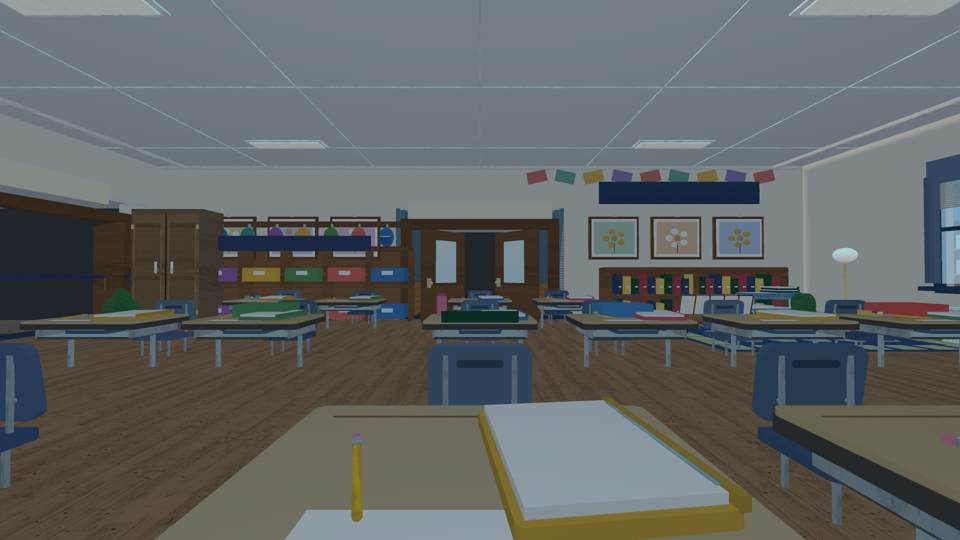
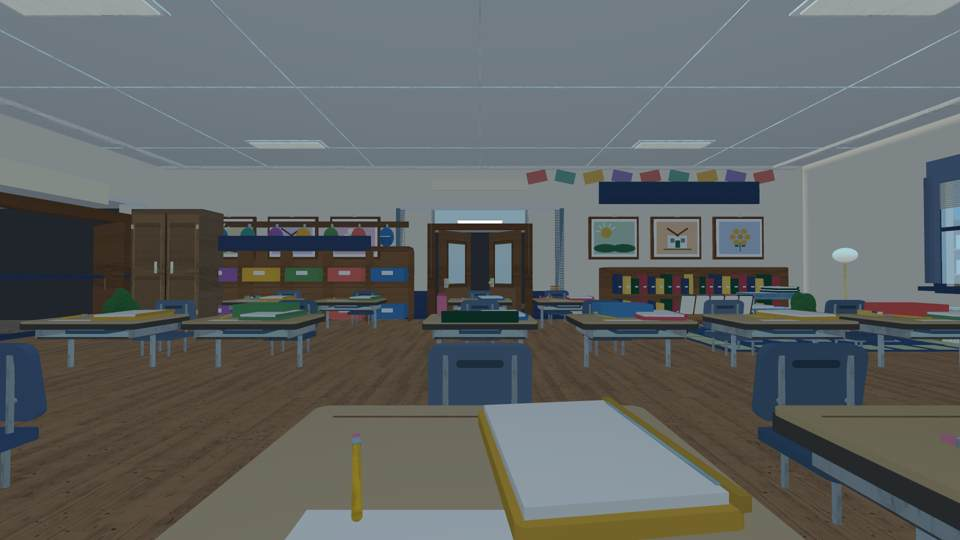
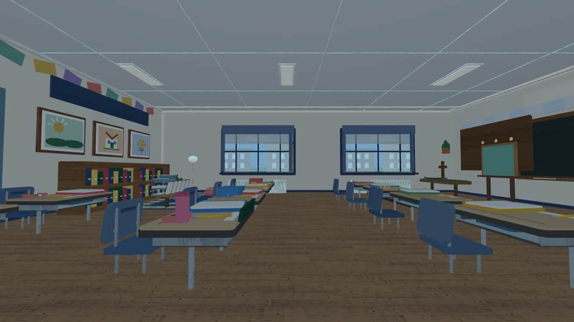
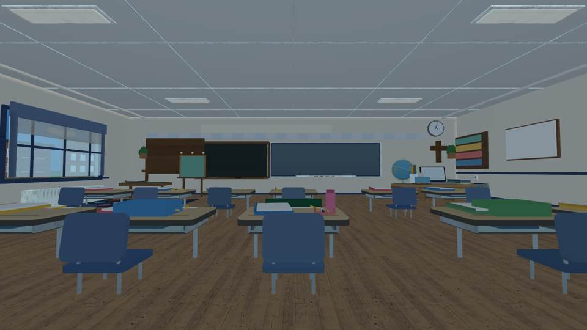
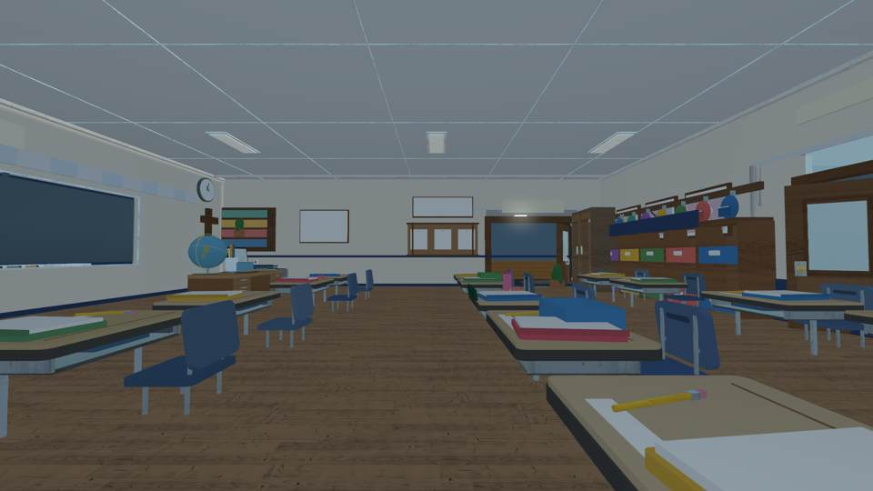
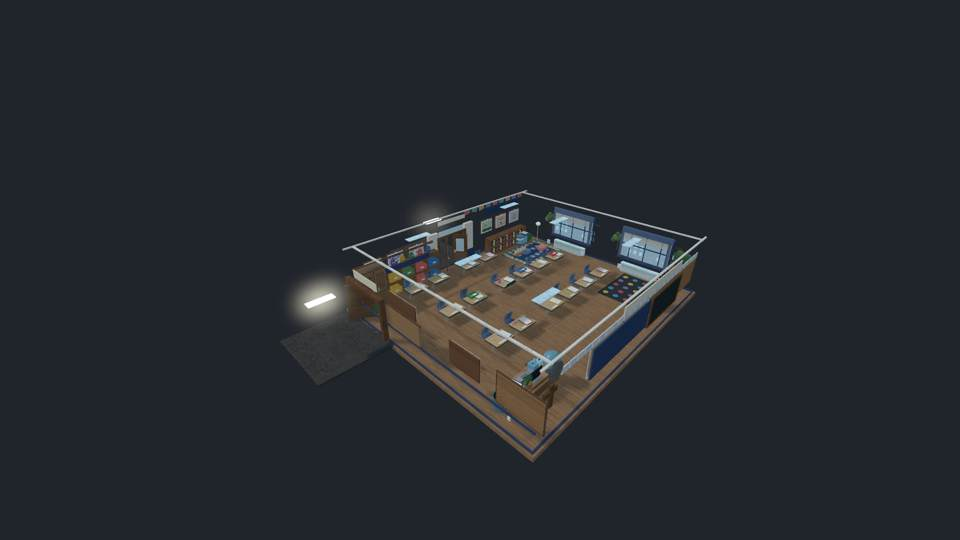
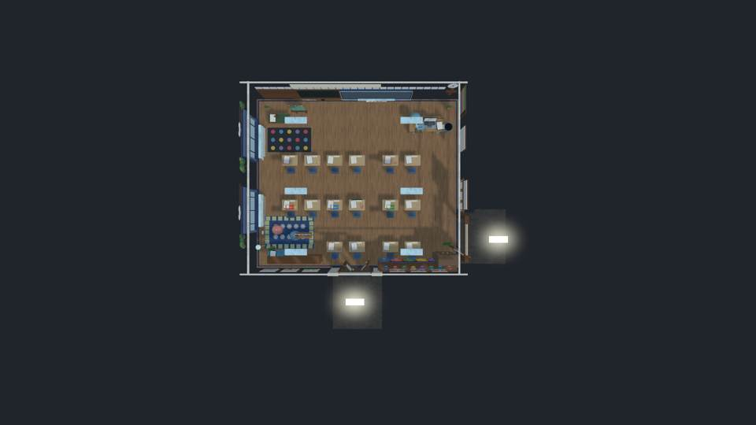

# Emma's classroom: source-derived visual QA (October 8, 2026)

These are **real pixel screenshots produced by the independent headless renderer from the Luau-constructed 3D scene**, NOT screenshots from Roblox Studio or an iPhone. Source geometry is evaluated, encoded into a snapshot, and rendered using the third-party renderer. Text on SurfaceGuis, precise Roblox materials, animation, game physics, and mobile performance cannot be accepted from these images.

Before source head: `2cedcc136f72cec5ce6e2b60b15734aa14a8b1cf`. [Before build and renderer](https://github.com/P00NSMASHER/PipsQuestWorld/actions/runs/37789360196).

After source head: `263565f47c19f1214217e9b6ab9d9466226a418a`. [Final six-check build and renderer](https://github.com/P00NSMASHER/PipsQuestWorld/actions/runs/37790135496).

## Before and after, same room camera

| Before | After |
| --- | --- |
|  |  |
|  |  |

## Additional after views

## Grounded visual changes

1. Replaced six duplicated identical gallery flowers with three original kinds of anonymous student artwork. First updated render passed, run 37789683813.
2. Replaced three spherical exterior tree crowns with smaller irregular leaf cluster arrangements. Second updated render passed, run 37789787034.
3. Narrowed an unusually broad double-door entry with plaster piers, wood stiles, divided glazed leaves, transom, and restrained signage. Final updated render passed, run 37790135496.

The original eye-level preview incorrectly used roof/wall cutaway geometry, making interior walls appear black. Eye-level cameras were corrected to use the entire room; the cutaway is retained only for exterior camera angles. Rendering artifacts are not fixes to the game.

## Rejection / limitations

The room remains relatively generic. Desk/chair silhouettes are still visibly part-built; room dimensions and the photo-to-world scale have not been measured against all original interior photo pixels in this run. The headless rendering system uses approximations for lighting, materials and UI. Roblox Studio eye-level and actual iPhone performance/movement are **UNTESTED**; no publication permitted. Preserve these distinctions in subsequent reviews.

No student names/photos or private schoolwork are included in these screenshots.
