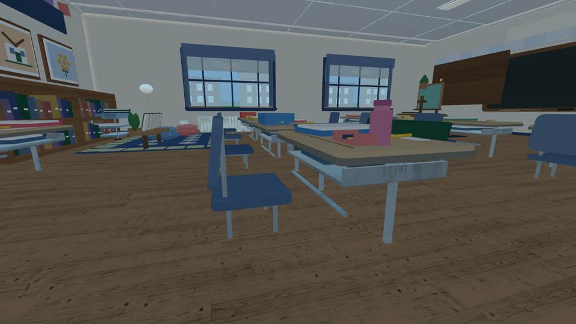
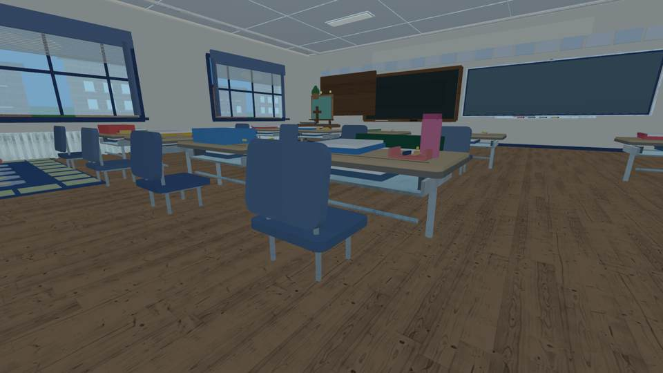

# Emma's desk: water-bottle realism and source-derived visual QA

**Before candidate:** `d62249154723100869aacbc1f883748a046231c4` · [source-derived camera run 37835641630](https://github.com/P00NSMASHER/PipsQuestWorld/actions/runs/37835641630)

**After implementation:** `0c861117ffd74eeeac8eb9d5bbdaec42c2bf1b0b` (room `8fe72edc1f6fe657c0c2c93a2ca4090c12a61eb8`, geometry QA `c53d7e69c343d175ce5061842a068075263ac7c4`) · [successful exact-source render 37837150131](https://github.com/P00NSMASHER/PipsQuestWorld/actions/runs/37837150131). The later documentation-only head `c3964fd2d477312414568d76cd77655232443506` renders identical room geometry.

These are **actual JPEGs from independently rendered Luau-built Roblox room geometry**, not artificial concept images or real Roblox Studio/iPhone screenshots. Same physical source and same camera settings other than this small prop correction.

## Side-by-side camera comparisons

| Before: oversized pink cylinder | After: shorter bottle with fitted shoulder |
| --- | --- |
|  |  |
|  |  |

## Independent review verdict

**Accepted as a modest improvement.** In both matched player-eye cameras the pink desk object is shorter and sits closer to the school supplies, no longer towering above neighboring notebooks. The silhouette is still simple Roblox primitive geometry, not a smoothly molded bottle mesh. Its muted pink color and smaller cap reduce its visual prominence. The surrounding desk, chair and architecture remain visually consistent.

The built Luau scene reports `EMMA_DESK_BOTTLE_GEOMETRY_PASS height=0.82 desk_gap=0.02 cap_top=4.26`. The cap and tapered shoulder are centered over the bottle body, the assembly stays inside Emma's tabletop, and geometry stays within the existing mobile part budget. Pixel validation passed on `10-desk-side.png` with `channel_span=211, white_ratio=0.000`. This is an **offline visual check**, not proof of gameplay physics.

**Verified:** classroom-only Rojo assembly, Luau runtime/geometry construction, original furniture fallback tests, source isolation, independent headless screenshot rendering. **Not verified:** Roblox Studio native rendering, touch movement, mobile frame time, imported premium furniture, photograph-to-room parity. Live Roblox place remains unchanged, and no release is authorized.

Do not infer the screenshot source is live Roblox or that the classroom is finished.
