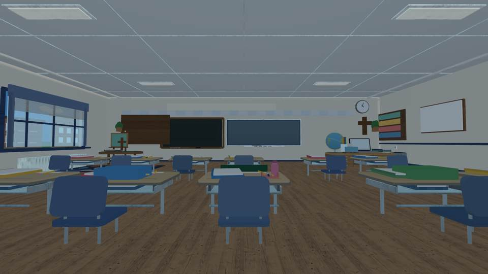
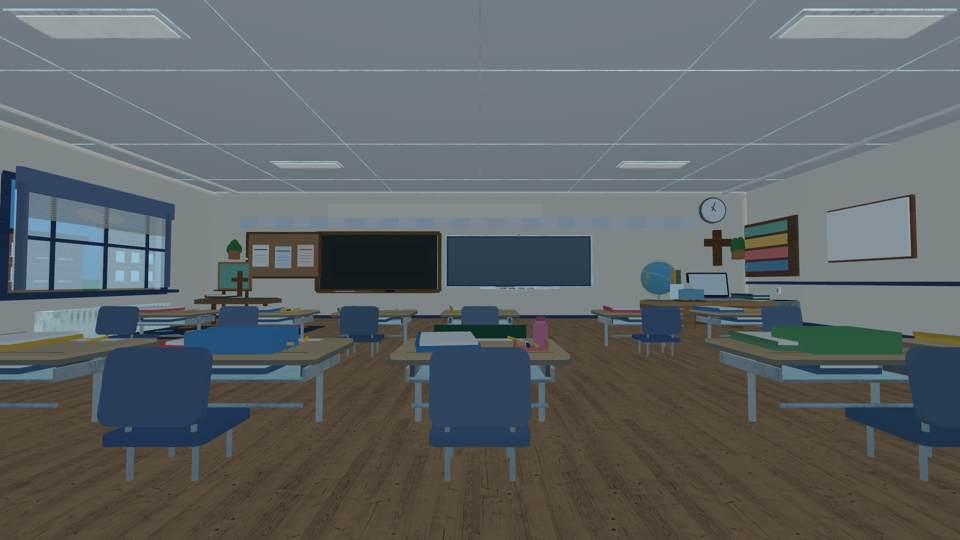
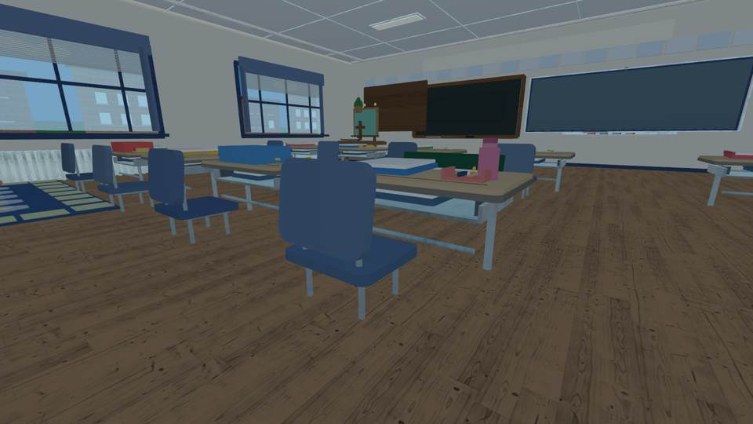
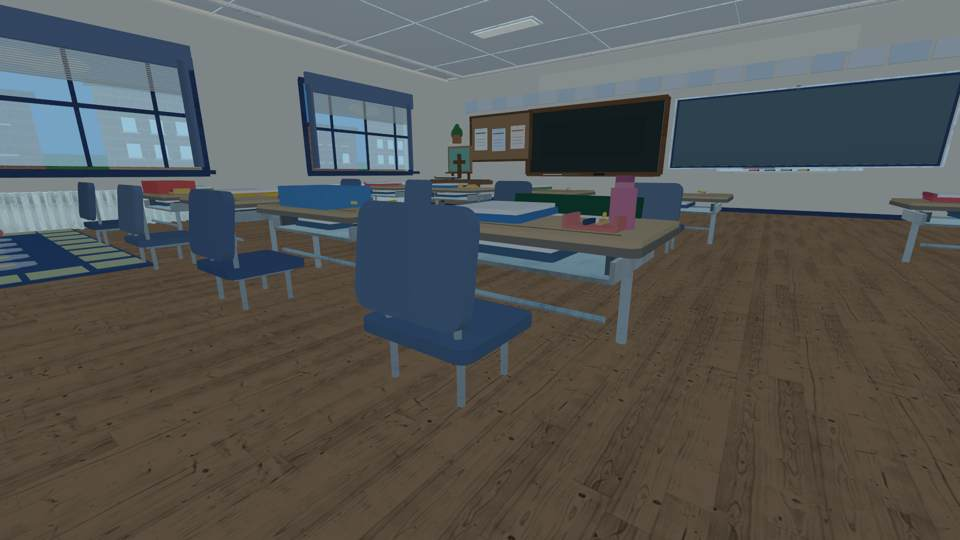
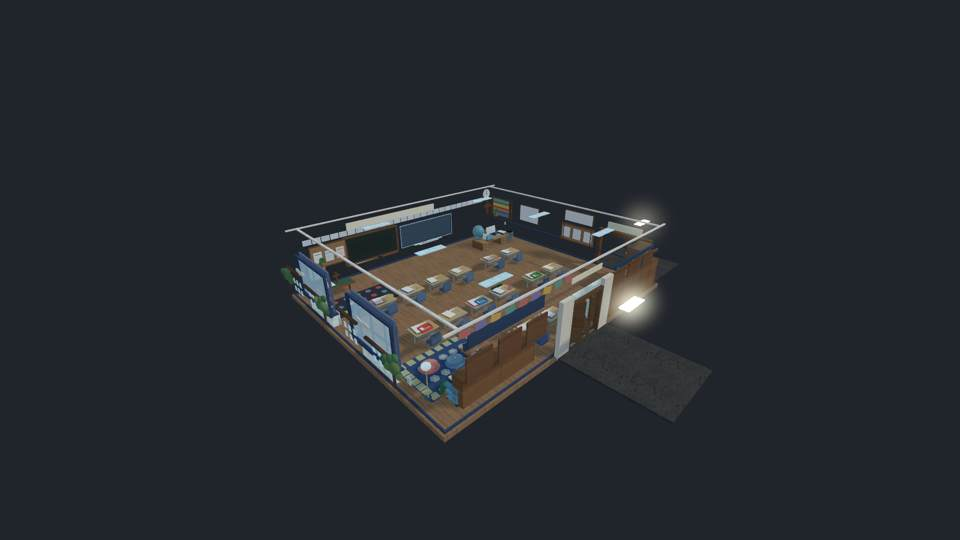

# Emma classroom — front teaching-wall visual finishing (October 8, 2026)

These are **actual image pixels rendered from the constructed Luau classroom** through an independent headless renderer. They are **not screenshots from Roblox Studio or iPhone gameplay**; SurfaceGui typography, Roblox materials, lighting, true collision, and mobile frame rate remain unverified.

The rejected October 8 classroom was quiz-first. This candidate still ships **no questions, teacher NPC systems, ranks or study HUD**. Only the visual classroom is under review.

## Three-step independent inspection

| Baseline | Easel-only correction | Accepted physical bulletin-board correction |
| --- | --- | --- |
|  |  |  |

The first correction shrank and moved the easel from 5.3 × 4.8 studs at x=-29 to **4.2 × 3.6 studs at x=-31**, with its physical stand, ledge, poster and decorative attachments following the new position. The [successful first render](https://github.com/P00NSMASHER/PipsQuestWorld/actions/runs/37843684198) showed that the large brown surface was **still present**.

A second inspection identified the actual defect: the `Student work board` had an opaque 12 × 7 stud **solid wooden frame in front of the cork**. It literally hid its own board. The source changed to a 9.4 × 5.65 stud display with a thin wooden backing behind exposed cork, a four-sided wood trim, and three real pinned work sheets (three heading strips, nine pencil lines, three brass pins). These are noninteractive room objects, not a game interface.

The final [source-derived render](https://github.com/P00NSMASHER/PipsQuestWorld/actions/runs/37845013739) shows the three sheets visible where the previous image had the blank brown panel.

## Second camera and whole-room control

| Before | After |
| --- | --- |
|  |  |

## Verified engineering

- Baseline source SHA: `014f3aaab7c6a2f5425ee49fe657145572a50c6d`. [Baseline visual run](https://github.com/P00NSMASHER/PipsQuestWorld/actions/runs/37838477246).
- Easel-only source SHA: `ff60f7cd3b8f3aa4f9cc0c6ec2c7ded5fe9aa7fd`. [First visual run](https://github.com/P00NSMASHER/PipsQuestWorld/actions/runs/37843684198).
- Completed room source SHA: `4d087b78a9968cabe8ce32d2d274f911b76e8c2c`. [Final visual run](https://github.com/P00NSMASHER/PipsQuestWorld/actions/runs/37845013739); [exact-head classroom build](https://github.com/P00NSMASHER/PipsQuestWorld/actions/runs/37845013763), PASS.
- Full scene count **2,871 physical parts**, 2,834 in cutaway; below the existing 3,100-part budget.
- Real Luau construction reports `TEACHING_WALL_GEOMETRY_PASS`, `EASEL_CHALKBOARD_CLEARANCE_PASS gap=7.30`, and `VISIBLE_BULLETIN_BOARD_GEOMETRY_PASS sheets=3 cork_exposed=true`.
- The full GitHub image gate passed on the final candidate. Blank images are not treated as acceptance.
- All desk positions, chair collision, first-person controls, study-system isolation, furniture fallback, and existing unrelated schedules remain unchanged.

## Remaining release blockers

The board is visually improved but the rest of the classroom remains part-built and does not yet establish exact photographic correspondence with the real Assumption BVM room. The original GLB models are still disabled because no authorized Roblox Assets API key has been established; the previously available publishing key was denied for model creation. Native Roblox render, on-device movement/performance and final visual comparison are still required.

**No PR merge or live Roblox game publication occurred.** This is source-derived visual acceptance of one localized room correction only.
