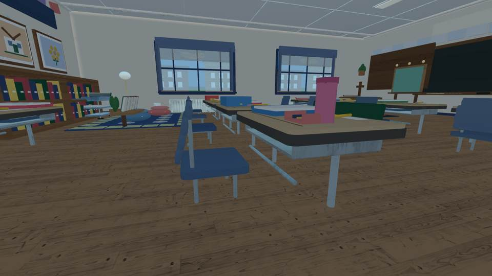
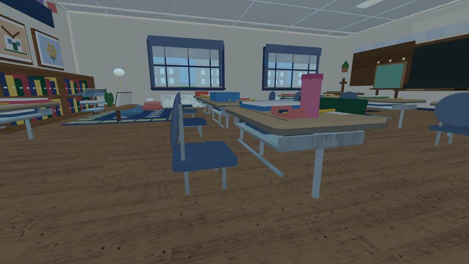
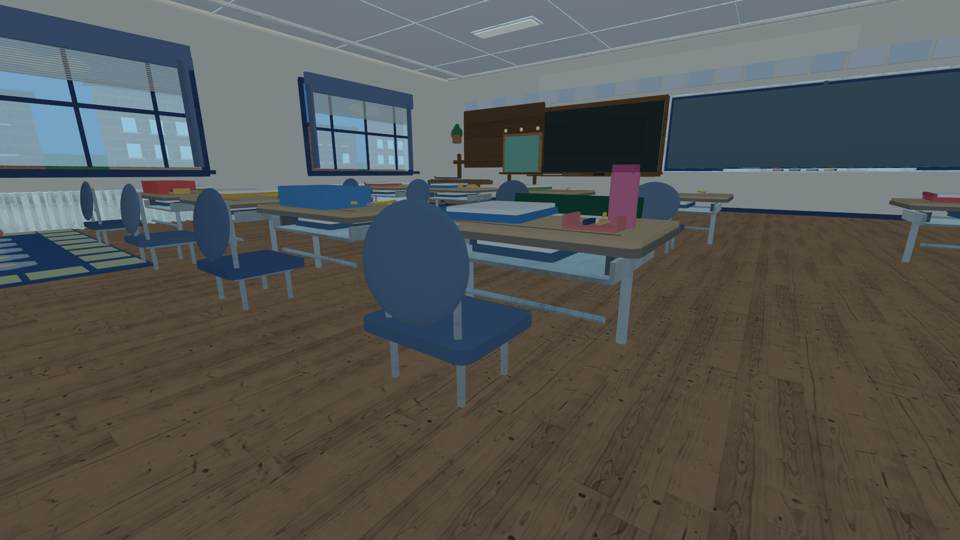
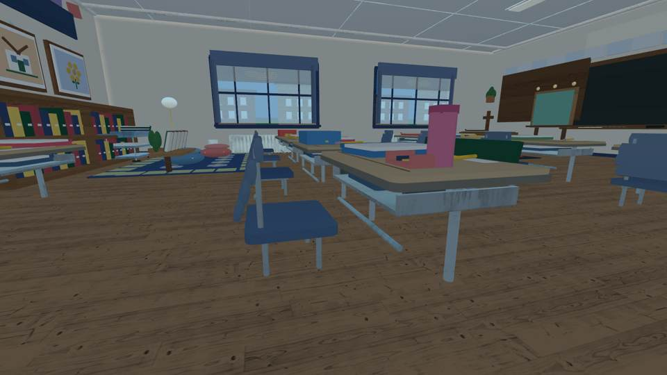
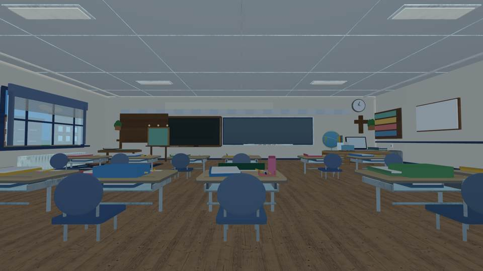
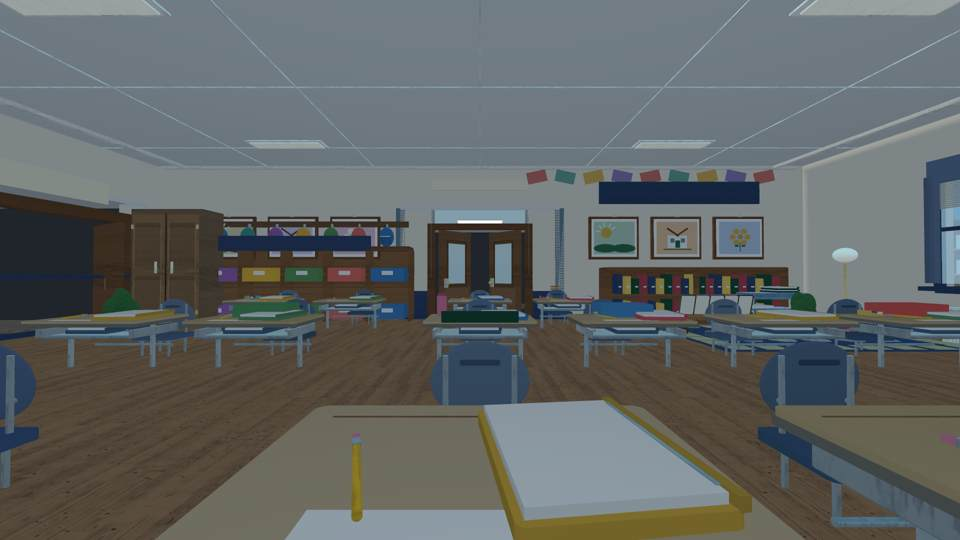
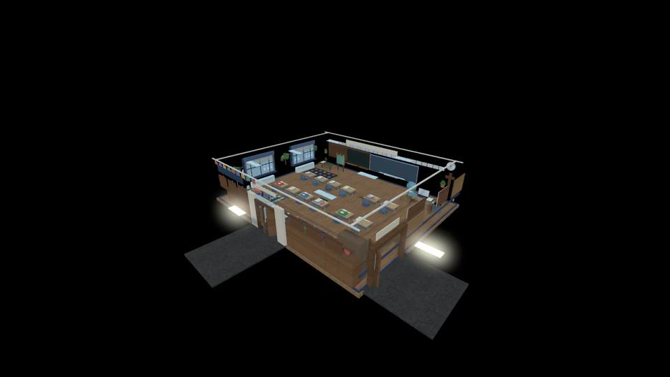

# Emma's classroom — furniture quality visual QA

**Source implementation SHA:** `4ab68c81456d0fb898ad86429d508b700cc3b3dc`  
**Actual GitHub Actions [visual run](https://github.com/P00NSMASHER/PipsQuestWorld/actions/runs/37798089586):** PASSED  
**Classroom-only Rojo build:** PASSED ([run](https://github.com/P00NSMASHER/PipsQuestWorld/actions/runs/37798089628))  
**Roblox Studio/iPhone:** NOT TESTED. **Release:** NOT APPROVED.

These are real rendered pixels from the third-party headless renderer executing the actual Luau room constructors, **not** fabricated image mockups and **not** native Roblox gameplay images. They cannot verify true in-engine materials, physics, camera clipping, touch movement, or iPhone frame rate.

## The improvement is visible, but this is not yet professional furniture

The first cutaway and eye-level review found flat, block-shaped chair backs and overly heavy desktop bands. The first chair redesign was a *rejected* four-section mold: real close-ups showed visible horizontal plate seams. We removed it rather than falsely claiming more Parts were better. The final candidate replaces each back with one continuous rounded shell and independent unobtrusive collision, and lightens/thins the desk edge. Desks received a slimmer under-basket, a support stretcher and laminate front bevel.

**Remaining defects:** The continuous shell is still too oval to be a convincing manufactured molded rectangular chair, and the student desks remain basic part-based furniture. An original smoothly modeled/rounded-rect mesh would be better, but it must be importable to Roblox under appropriate user rights and verified in the actual engine. Exact parity with real classroom photographs is not established.

## Before and after — furniture and front of room

| Earlier bulky desk edge | Corrected desk edge |
| --- | --- |
|  |  |

| Rejected four-panel chair | Continuous-shell revision |
| --- | --- |
|  |  |

The intermediate rejected desk/source appearance remains available here:

## Room-view controls after the final revision

The aerial isometric renderer formerly returned an almost empty white frame but passed a naïve pixel-span check. The final CI uses a fixed camera position plus a mostly-white-pixel rejection threshold. Actual check: `VISUAL_NONBLANK_PASS 01-isometric channel_span=255 white_ratio=0.000`.

## Acceptance evidence and hard boundaries

- Full constructed geometry: **2,688 physical parts**, cutaway: **2,651**, under the 3,100 budget; no measured Roblox iPhone frame time
- One continuous molded chair shell and one separate physical back collider per chair, across all 16 chairs; no segmented decorative plates
- Student desk positions, movement controls, schoolwork-file archive and classroom-only scope preserved
- All six exact-source GitHub workflows passed at `4ab68c81456d0fb898ad86429d508b700cc3b3dc` including source-derived image generation
- No quiz ScreenGui, teacher questions, grading or learning DataStore shipped in the showroom build
- No Roblox production publish, no merge, no edits to unrelated automations

## Remaining acceptance gate

Actual Roblox Studio/physical iPhone views must prove the final model looks acceptable, that movement/camera remain normal, that collision and mobile performance are healthy, and that the proportions resemble the user-supplied classroom photos. Source-rendered image quality alone cannot pass that gate.
