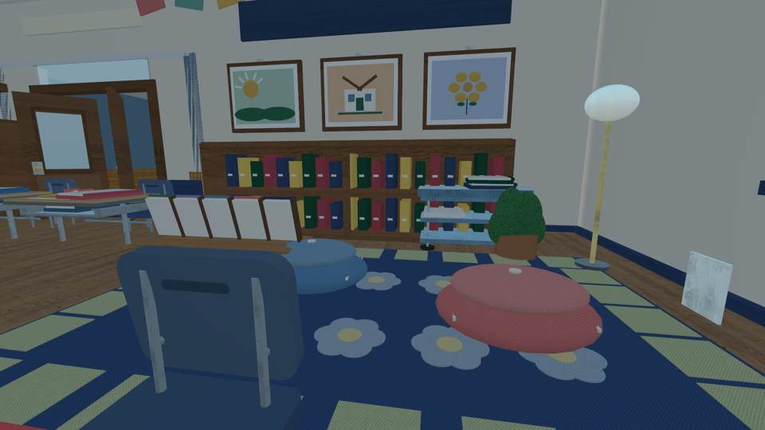
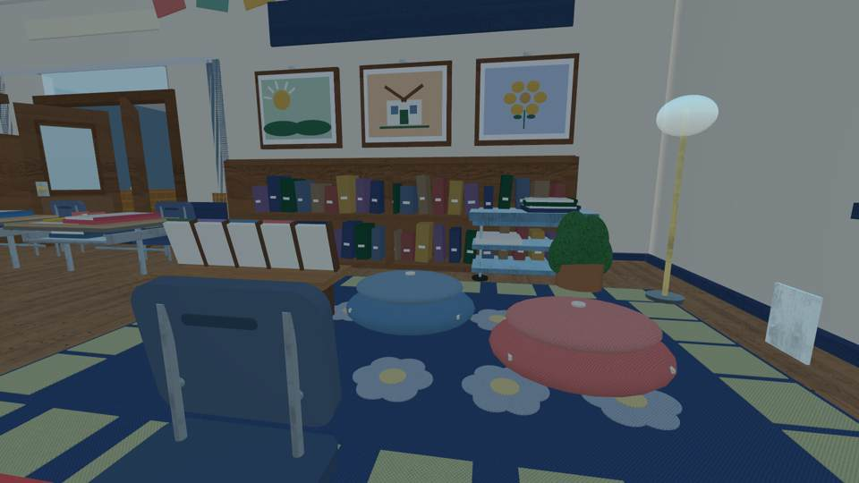
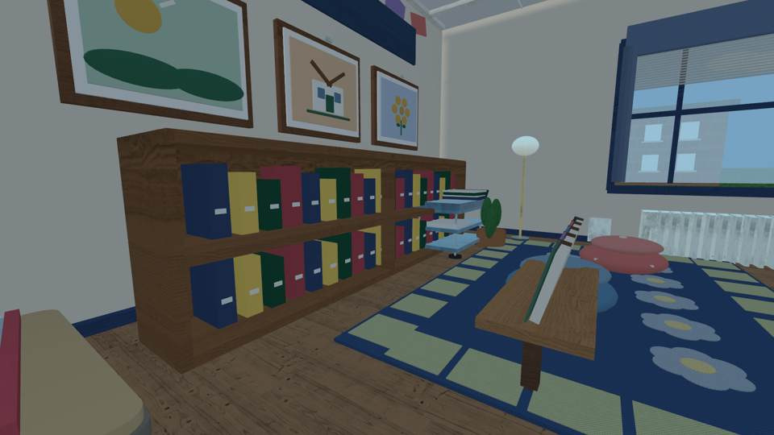
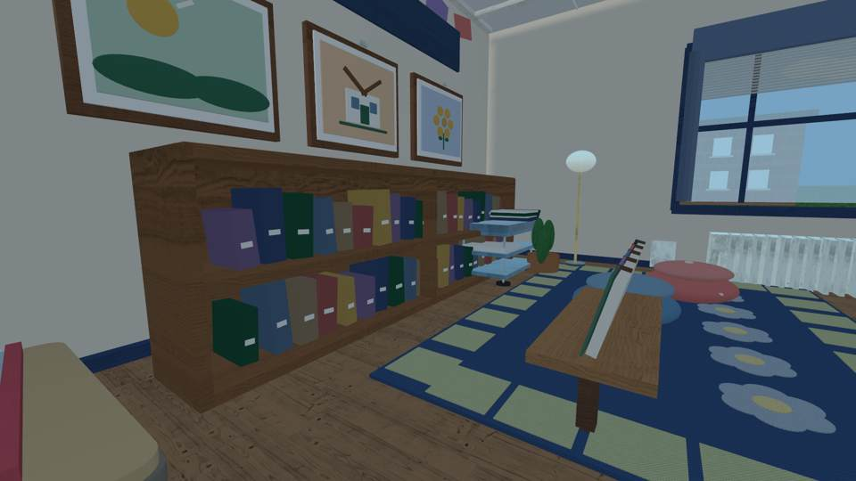
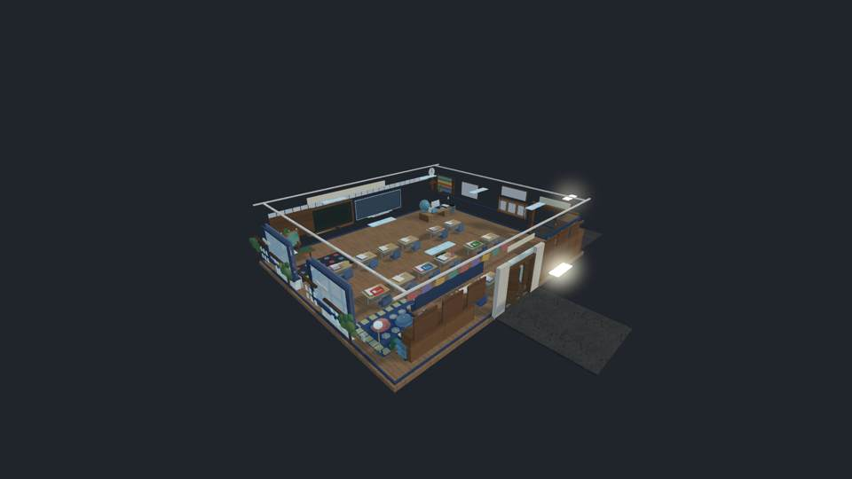

# Emma classroom: reading corner before/after visual review

**Source implementation:** `d62249154723100869aacbc1f883748a046231c4`.

**Actual independent screenshot evidence**, from fixed source-derived Luau geometry rather than Roblox Studio gameplay:
- [Unchanged baseline 13-view run](https://github.com/P00NSMASHER/PipsQuestWorld/actions/runs/37835078499), SHA `d4599c46423f2255f7ba358adc9cd581451f5f78`
- [Corrected pouf-only run](https://github.com/P00NSMASHER/PipsQuestWorld/actions/runs/37835320487), SHA `048b69565cec658d7ea2c63999690e36cb9170c4`
- [Final correction and visual run](https://github.com/P00NSMASHER/PipsQuestWorld/actions/runs/37835641630), SHA `d62249154723100869aacbc1f883748a046231c4`, all seven source-head workflows passed

## Reading rug (identical actual camera)

| Before: pouf crowded into low book rack | After: the pouf clears the rack |
| --- | --- |
|  |  |

## Bookshelf (identical actual camera)

| Before: 40 repeated, uniform book spines | After: varied widths, heights, colors and slight lean |
| --- | --- |
|  |  |

## Verified changes

- Second floor pouf moved from x=-22.7 to x=-24.7 without moving the actual rack/rug or adding new Parts.
- Executed source geometry produced `READING_NOOK_CLEARANCE_PASS pouf_to_rack=0.30 seat_to_seat=0.40 chairs=2`.
- Forty original book spines remain, now four widths, five heights, subtle rotation and individual spine-linked labels. Executed source geometry produced `READING_BOOKCASE_VARIATION_PASS books=40 widths=4 heights=5`.
- **2,848 physical source Parts**, 2,811 cutaway. No parts added, no study questions, NPCs, menus, rank UI or changes to live game.
- Before/after pixels were independently inspected. These are real third-party renders of Luau-constructed geometry, not native Roblox images.

**Verdict:** Small but visible reading-corner quality improvement accepted for source development. Not photo-perfect, still primitive-based; original school reference images were unavailable for exact measurement. Roblox Studio/iPhone native rendering, physics and frame rate remain unverified. Importer remains disabled, PR draft, no production release or unrelated task changes.
