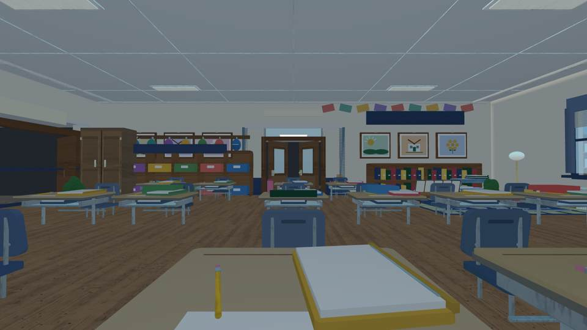
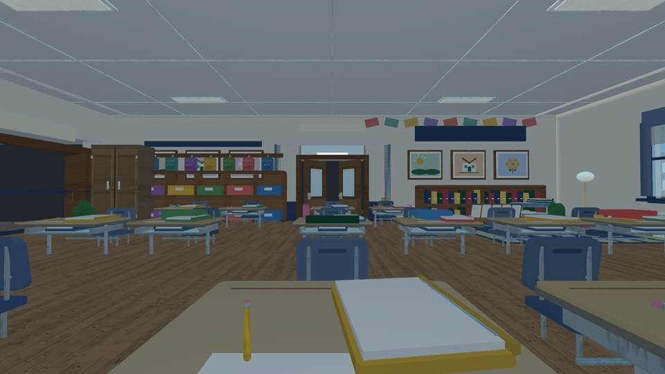
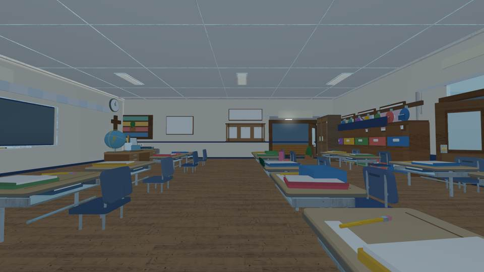
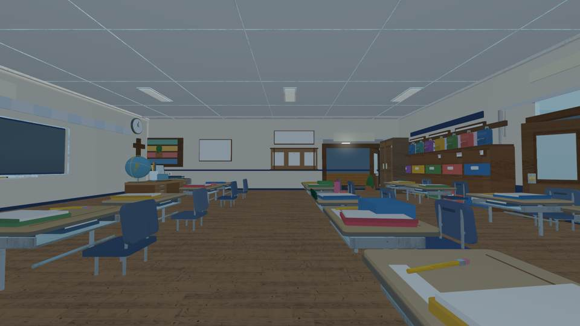
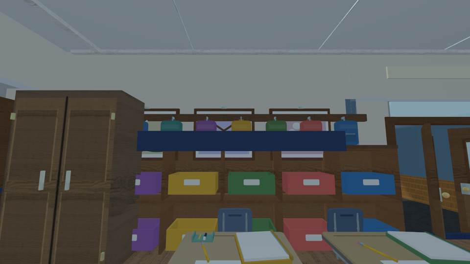
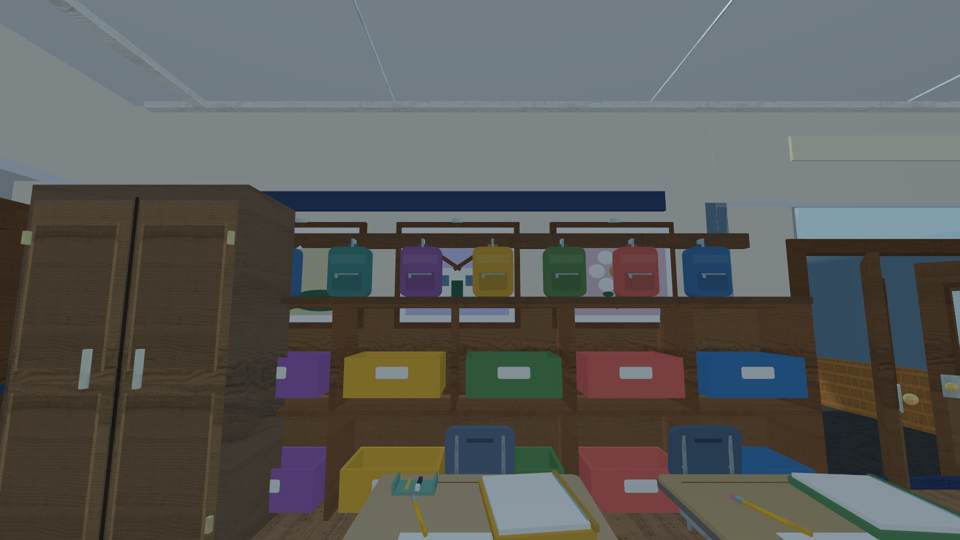
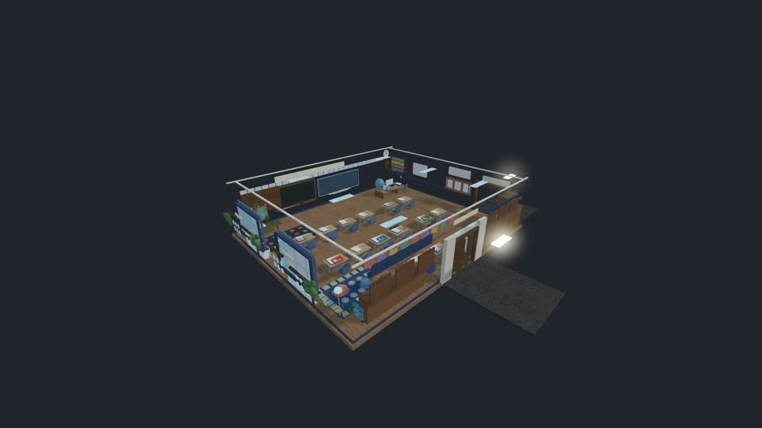

# Emma classroom: backpack and cubby visual finishing

**Verdict: ACCEPTED incremental architectural improvement, NOT Roblox-engine acceptance.**
All images are **actual independent third-party 3D renders of Luau-generated classroom geometry**; they are not Roblox Studio or iPhone screenshots. Material appearance and on-device performance remain unverified.

## Source-equal eye-level view, before and after

| Original oval bags and obstructing sign | Finished schoolbag silhouettes and raised sign |
| --- | --- |
|  |  |
|  |  |

## Close-up adversarial review

**Rejected intermediate:** Backpacks were resculpted but an oversized blue cubbies sign at y=8.8 masked their pockets and lower halves, so the work was not visually presentable.

**Accepted:** Same actual source-derived close-up camera, with the sign relocated to y=13.0 and sized at 19 × 0.9 studs. Fabric-body rounded backpacks, pocket flaps, hanging loops and hooks are visible without the sign crossing the bags.

## Implemented and verified

- Before reference source `55792c60964842442f49ed036332c5c341b44220`, [baseline passing preview](https://github.com/P00NSMASHER/PipsQuestWorld/actions/runs/37822326778).
- Resculpted bags source `4543a92f6416f252b7a29dd01451cbabe1c39f97`; independent intermediate [run 37828418569](https://github.com/P00NSMASHER/PipsQuestWorld/actions/runs/37828418569), retained as rejected due to physical sign obstruction.
- Corrected Fabric shell source `f2b8efd7a91c7fefb2348a65a1e0db579e984fb9`; [source render 37828933536](https://github.com/P00NSMASHER/PipsQuestWorld/actions/runs/37828933536) passed material and geometry guards, but original sign remained in front.
- **Final constructed source SHA:** `6e92563e38fb3b9277a0998cea51e5e36a8bc3e3`, [independent eleven-view render 37829310449](https://github.com/P00NSMASHER/PipsQuestWorld/actions/runs/37829310449) **passed**. Original classroom-only Rojo build and the five other independent GitHub checks passed at this SHA.
- Real exporter log: `BACKPACK_STORAGE_GEOMETRY_PASS count=8 cubby_bins=12 hooks=8 material=Fabric handle_mount_gap=.07 sign_lower_edge=12.55`.
- **2,848 physical parts** in the actual Luau-built room; **2,811** in intentional preview cutaway; within unchanged 3,100-part static budget.
- Eight originally ellipsoid bags are now attached, rounded rectangular fabric backpacks with strap details, hanging loops, flaps, pockets, zippers and pulls. All twelve bins and doors remain in their prior positions. No custom gameplay UI or questions restored.
- Final storage close-up passed the unchanged strict image gate: `channel_span=228`, `white_ratio=0.000`. Actual pixels were independently inspected; no blank or misleading screenshot counted as acceptance.

## Remaining limitations and release boundaries

The room still has part-built desks/cubbies and no native Roblox Studio/iPhone screenshot, physics walk-through or device frame-time measurement in this task. The original real ABVM classroom reference photos were not available for direct measurement in this run. The owner-managed GLB furniture importer remains disabled and assets unapproved. This is **not** a production release: PR #339 stays draft, live Roblox place is unchanged, educational code and scheduled tasks untouched.
