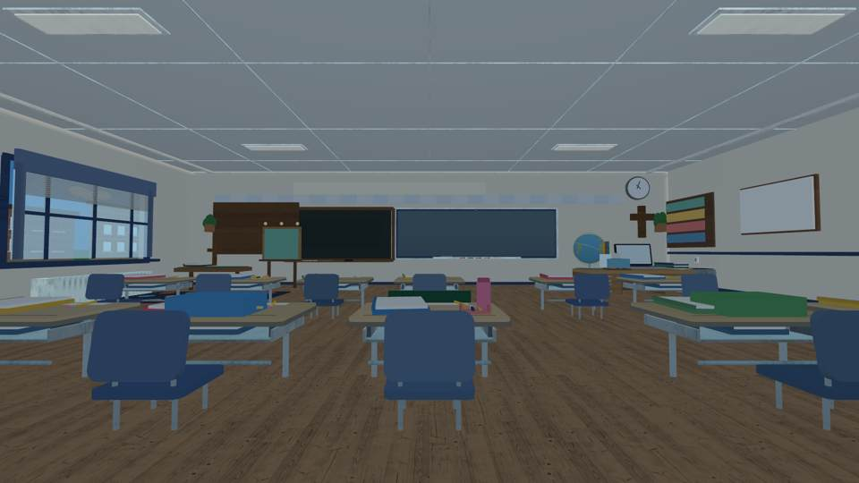
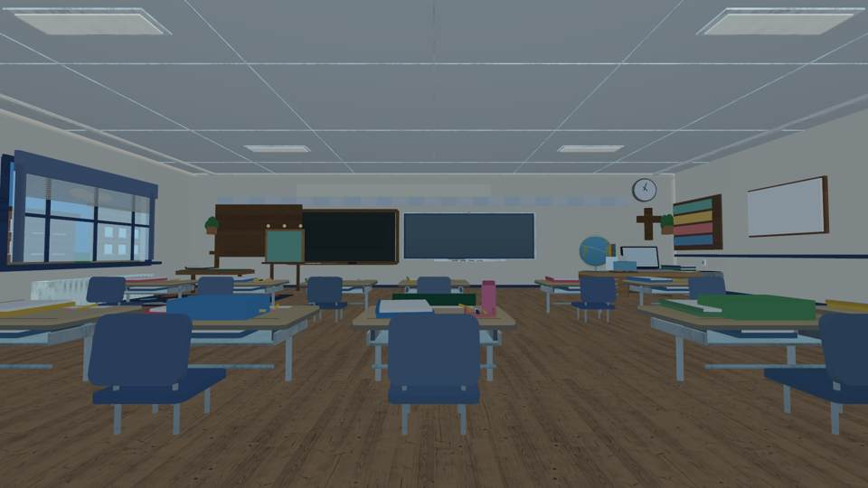
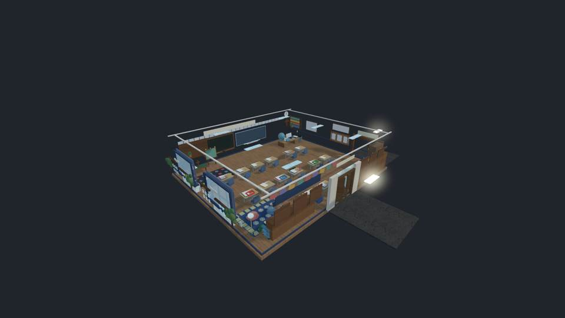

# ABVM Classroom: front teaching-wall visual correction

This change is to the actual classroom-only Luau geometry, not a concept image.

- **Before source:** `9908edd813adc22cbfdbc0537d184e3adbc80c0a`
- **After implementation source:** `e4f22d89ba3c8d28df472329bf8fc02cd67e3733`
- **Before renderer:** [successful original classroom visual run](https://github.com/P00NSMASHER/PipsQuestWorld/actions/runs/37815655519)
- **After renderer:** [successful exact-head front-wall visual run](https://github.com/P00NSMASHER/PipsQuestWorld/actions/runs/37818537556)

## Direct comparison: identical full-room camera

| Previous 23.5-stud Smartboard | Rescaled 18.85-stud Smartboard |
| --- | --- |
|  |  |

## Source-derived isometric context after

## Changes

- Reduced Smartboard width from **23.5** to **18.85 studs** (approximately 19.8% reduction). Recentered at X=5.2.
- Set physical bezel width to **19.35** and board height to **6.35** studs, preserving distinct chalkboard treatment.
- Re-aligned the true 3D metal surround, two side trims, marker shelf, markers, styluses, integrated board camera and pen tray. This is architectural finishing; there is no quiz GUI.
- The actual constructed Luau part export reported **TEACHING_WALL_GEOMETRY_PASS**: Smartboard 18.85 studs, chalkboard 15.80 studs, horizontal gap 1.57 studs, bezel 19.35 studs.
- Total construction remains **2,768 physical parts** (**2,731** in cutaway). No gameplay features or new meshes were included.
- GitHub's exact-head classroom build, GLB-generation and all unrelated pre-existing nonvisual checks passed. The visual run also **passed**, recovering from one all-white aerial frame by using the existing strict alternate-camera gate.

## Independent visual verdict

**Incremental improvement accepted:** the formerly dominating wide Smartboard now reads at a size comparable to its neighboring chalkboard. The bezel and physical trim appear aligned, and the front teaching surface feels better balanced. The change has been reviewed in actual source-derived eye-height and isometric images. No unverified additional props were introduced.

**Limitations:** these are *third-party source-derived renders*, NOT actual Roblox Studio/iPhone screenshots. Roblox SurfaceGui text and real engine material effects are not faithfully represented in the offline renderer. Exact parity with the real ABVM classroom photographs, iPhone frame time, collision, and native visual acceptance remain unverified. The original user photos could not be retrieved for pixel-by-pixel matching in this iteration.

No live publication, no PR merge, no changes to student question software, scheduled tasks, or the pending Roblox furniture-mesh authorization.
